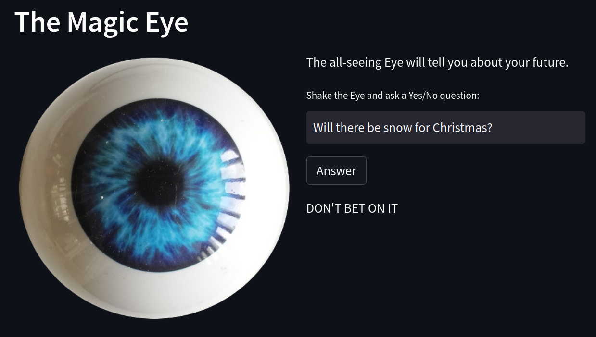

# The Magic Eye

A simple web app version of the all-seeing magic Eye that foretells your future.

The physical Eye is located in the [Uwe Ohler's Computational Regulatory Genomics laboratory](https://ohlerlab.mdc-berlin.de/) at the Berlin Institute for Medical Systems Biology in Berlin, Germany.

---

Disclaimer: the predicitons of the web version are less precise. Undoubtedly, the person physically touching the Eye is very important to make correct predictions. Use at your own risk. No liability is held for any adverse outcomes resulting from reliance upon the predictions.

All rights belong to the unkown designer of the original Eye.
